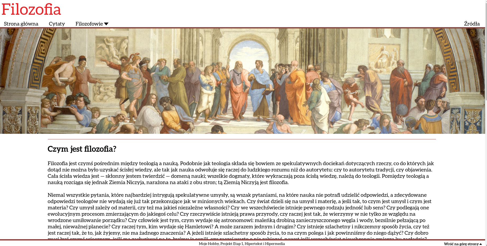
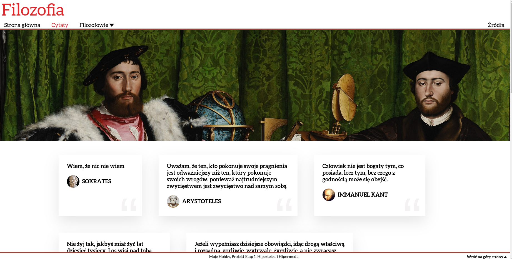
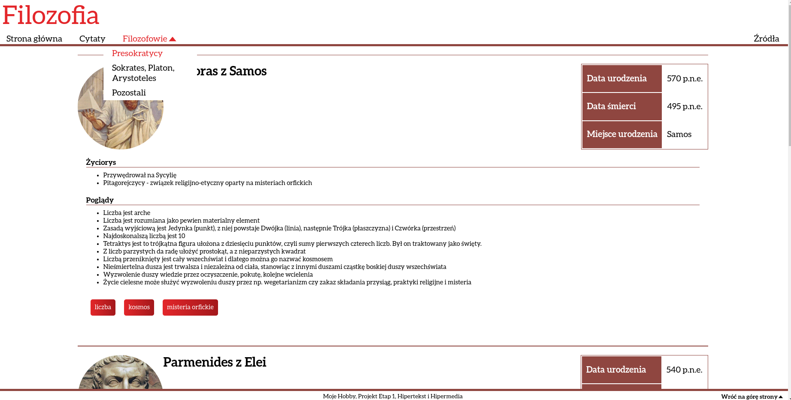

# My hobby - philosophy
## HTML website and XML representation of site data

This is a project I did during my first term of informatics studies on Gdańsk University of Technology.

It presents a simple website with a few pages and a simple XML representation of the site data.

The website is written in HTML and CSS, and the XML representation is written in XML.

It was written to show the basics of HTML and XML, XML Schema and XSLT.

